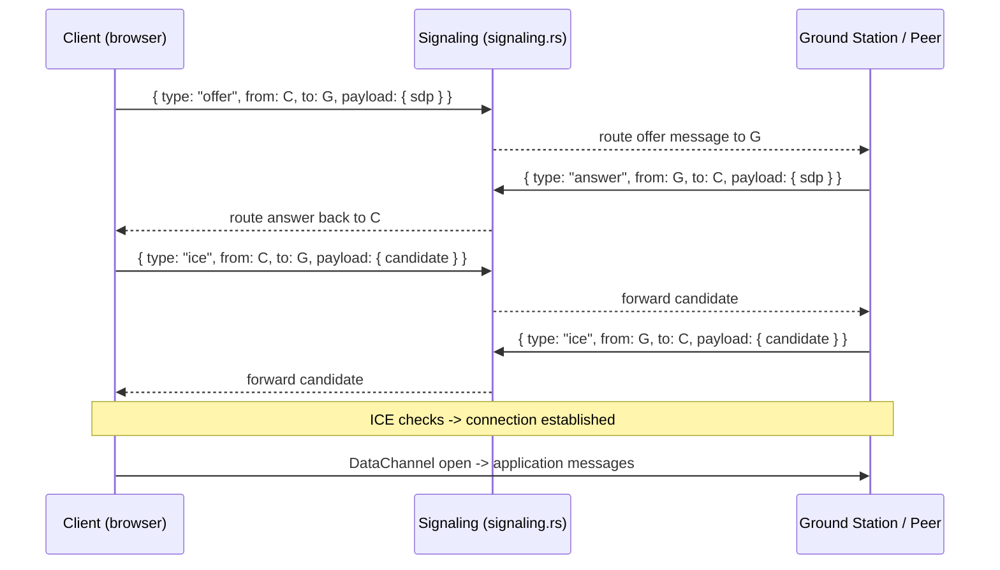

# Client Connection System — Step-by-step Explanation

This document explains how the client connection system in this codebase works. It is written to be both in-depth and easy to understand: follow the numbered steps for the connection lifecycle, then consult the component references to locate the implementation in the repo.

## Scope and audience
- Audience: engineers who want to understand or modify the connection/subsystem (Rust and frontend parts).
- Scope: signaling, WebRTC peer lifecycle (offer/answer, ICE), data channels, how messages are routed in `connect_lib`, and how the frontend JavaScript interacts with the system.

## Quick map (where to look in code)
- Rust server/client glue: `src-tauri/src/connect_lib/` (modules: `signaling.rs`, `peer_factory.rs`, `client.rs`, `server.rs`, `protocol.rs`, `network.rs`).
- Frontend glue: `src/connect-bridge.js`, `src/connections.js`, and `src/main.js` which use the browser-side WebRTC APIs and the app UI.

## High-level overview

The system connects application clients (web UI and native-tauri client components) into peer-to-peer (P2P) WebRTC connections. A separate signaling layer is used to exchange SDP offers/answers and ICE candidates. The signaling transport is an application-level message bus implemented in `connect_lib` (Rust). Once peers exchange SDP+ICE via signaling, they form direct WebRTC peer connections and exchange application data over DataChannels.

At a conceptual level:
1. Two endpoints agree they want a P2P link (initiator and answerer).
2. The initiator creates a `RTCPeerConnection` and a DataChannel, then creates an SDP offer.
3. The offer is packaged and sent (JSON) via the signaling channel to the remote endpoint.
4. The remote endpoint sets the offer as remote description, creates an answer, and sends it back over signaling.
5. Both endpoints exchange ICE candidates as they are discovered.
6. When connectivity checks succeed, the DataChannel becomes `open` and app-level messages flow.

This repo splits responsibilities between frontend code that uses WebRTC APIs and Rust code in `connect_lib` that provides peer management, signaling routing, and application-level protocol handling.

## Step-by-step connection lifecycle (detailed)

1. Initiation

 - Trigger: the UI or a component decides it needs to connect to another node (for example, to exchange tracking data).
 - Frontend action: create an `RTCPeerConnection` and a reliable/unreliable `DataChannel` depending on needs (text/JSON messages vs streaming telemetry).
 - In code: `src/connections.js` contains the logic to construct peer connections and data channels and to install event handlers for `icecandidate`, `datachannel`, and `connectionstatechange`.

2. Create offer (initiator)

 - The initiator calls `createOffer()` on the `RTCPeerConnection` and then `setLocalDescription(offer)`.
 - The SDP offer is serialized along with metadata (target ID, sender ID, optional capabilities) into a JSON signaling message.
 - The signaling send is performed by the app's signaling transport (in browser that might be a WebSocket or a Tauri IPC call implemented by `connect-bridge.js` to Rust).

3. Signaling delivery

 - The serialized offer arrives at the server-side routing layer implemented under `src-tauri/src/connect_lib/`.
 - `signaling.rs`'s responsibilities:
   - Parse incoming signaling messages (offers, answers, ICE candidates, control messages).
   - Authenticate and validate sender/recipient IDs and route the payload to the correct `client` handler.
   - Persist or queue messages briefly if the recipient is temporarily offline (implementation dependent).

 - On the recipient side, the signaling receiver hands the SDP offer to the application-level connection handler (`client.rs` / `peer_factory.rs`), which maps the message into the corresponding `RTCPeerConnection` creation logic.

4. Answer creation (answerer)

 - The recipient creates or re-uses an `RTCPeerConnection`, calls `setRemoteDescription(offer)`, and then `createAnswer()`.
 - The answer is `setLocalDescription(answer)` and serialized into a signaling answer message.
 - The answer is sent back via the same signaling layer to the initiator.

5. ICE candidate exchange

 - As the browser/native engine gathers ICE candidates (host, srflx, relay/TURN), it emits `icecandidate` events.
 - Each candidate is sent as a small signaling message to the remote peer.
 - The recipient calls `addIceCandidate()` to add the remote candidate to its `RTCPeerConnection`.
 - Timing: candidate messages can arrive before or after SDP; implementations must buffer remote candidates until `setRemoteDescription()` has been called.

6. Connectivity checks and DataChannel open

 - ICE connectivity checks run; when successful the peer connection reports `connected`/`completed` state.
 - The data channel transitions to `open` and the application-level protocol uses it to send/receive JSON messages (position updates, keepalives, control commands).

7. Liveness, keepalive, and re-negotiation

 - The application monitors `connectionState` and `iceConnectionState`. On transient outages, it attempts reconnection (recreate offer/answer or rely on ICE restarts).
 - Some systems use a keepalive ping over the DataChannel and a fallback to signaling if the DataChannel breaks.

8. Teardown

 - When either side closes the connection intentionally, they close their DataChannel and `RTCPeerConnection` and send an application-level `close` control message via signaling (optional but helpful for graceful cleanup).
 - The server-side `connect_lib` cleans up references so resources are freed and future connections can reuse IDs.

## Message formats and protocol

- Signaling messages are simple JSON objects with a `type` field (`offer`, `answer`, `ice`, `control`) and an envelope that includes `from`, `to`, and `payload` fields. Example:

```json
{
  "type": "offer",
  "from": "clientA",
  "to": "clientB",
  "payload": { "sdp": "v=0..." }
}
```

- ICE message example:

```json
{
  "type": "ice",
  "from": "clientA",
  "to": "clientB",
  "payload": { "candidate": "candidate:...", "sdpMid": "0", "sdpMLineIndex": 0 }
}
```

Refer to `src-tauri/src/connect_lib/signaling.rs` for the exact parsing and schema in use.

## How the Rust `connect_lib` is organized (conceptual)

- `signaling.rs`: message parsing, routing, and validation. Acts as the dispatcher for incoming application-level signaling messages.
- `client.rs`: represents a connected client instance. Stores client identity, connection state, and queues of messages destined for that client.
- `peer_factory.rs`: builds and tracks logical peers or connection objects. It maps requested connections to handlers and kickstarts server-side actions needed for NAT traversal or relays.
- `server.rs`: top-level server orchestration: listens on transports, accepts new client connections (e.g., WebSocket/Tauri IPC), binds them to `client` instances.
- `protocol.rs`: defines the higher-level application protocol messages sent over the DataChannel after the WebRTC link opens.
- `network.rs`: low-level socket/transport helpers (if the project implements additional transports beyond WebRTC).

Files of interest:

- `src-tauri/src/connect_lib/signaling.rs` — main signaling router.
- `src-tauri/src/connect_lib/client.rs` — client lifecycle and message queueing.
- `src-tauri/src/connect_lib/peer_factory.rs` — peer instantiation logic.

## How the frontend code ties in

- `src/connect-bridge.js` is the bridge between the UI and native signaling endpoints when running as a Tauri app. It forwards signaling messages from the JavaScript world to the Rust `connect_lib` transport and vice versa.
- `src/connections.js` contains the WebRTC client-side logic: building `RTCPeerConnection`, creating offers, listening for `icecandidate` events, and exposing an application-level API for sending messages over the DataChannel.

Flow summary (frontend to Rust):
1. UI invokes a connect action in `connections.js`.
2. `connections.js` creates a peer connection and emits a signaling `offer` message using `connect-bridge.js`.
3. `connect-bridge.js` forwards the JSON to the Tauri backend IPC/WebSocket where `signaling.rs` receives and routes it.

## Faults and recovery patterns (practical guidance)

- Buffer remote ICE candidates until remote description set.
- Implement exponential backoff for retries when signaling transport is unreachable.
- Use STUN+TURN for better NAT traversal; make sure the TURN credentials are available and rotated securely.
- On persistent failures, fall back to relayed server connections or notify the user.

## Security considerations

- Authenticate signaling messages; do not accept offers/answers from unauthenticated sources.
- Validate SDP contents and guard against very large messages.
- Use secure transports (WSS / Tauri's secure IPC) for signaling.

## Example troubleshooting checklist

1. No data channel open: check ICE candidate exchange logs and `iceConnectionState`.
2. Offer/answer not delivered: inspect signaling server logs (`signaling.rs`) and transport links.
3. One-way audio/data: inspect whether a candidate is missing (host vs srflx vs relay).

## References and next steps

- See `src-tauri/src/connect_lib/signaling.rs` for the message parsing and routing logic.
- See `src/connections.js` and `src/connect-bridge.js` for the client-side WebRTC glue.

If you want, I can:
- Add sequence diagrams showing message flow.
- Add code excerpts from `signaling.rs` and `connections.js` annotated inline.

---
Created as an overview and a step-by-step guide; ask for any areas you'd like expanded into code-level walkthroughs.

## Sequence diagrams (signaling and WebRTC flow)



## Annotated code excerpts

Below are small, focused excerpts from the codebase with short annotations explaining the important lines. Use these to orient yourself quickly before diving into the full file.

- `src-tauri/src/connect_lib/signaling.rs` — `SignalMsg` enum (message schema)

```rust
#[derive(Serialize, Deserialize, Debug, Clone)]
#[serde(tag = "type", rename_all = "snake_case")]
pub enum SignalMsg {
  Register { id: String },
  Offer {
    from: String,
    to: String,
    sdp: String,
  },
  Answer {
    from: String,
    to: String,
    sdp: String,
  },
  Ice {
    from: String,
    to: String,
    candidate: String,
    sdp_mid: Option<String>,
    sdp_mline_index: Option<u16>,
  },
  Registered { id: String },
  LookupResult { id: String, online: bool },
  ListResult { peers: Vec<String> },
  Error { message: String },
}
```

Notes:
- The `type` tag in serde means incoming JSON is discriminated by the `type` field. This maps directly to the signaling JSON messages shown earlier.
- `Offer`, `Answer`, and `Ice` are the core real-time messages used to establish WebRTC.

- `src-tauri/src/connect_lib/signaling.rs` — `connect_signaling` (registration + read/write loop)

```rust
pub async fn connect_signaling(my_id: &str) -> Result<SignalingConnection, String> {
  // connect to server (connect_ws) and send Register message
  let reg_json = serde_json::to_string(&SignalMsg::Register { id: my_id.clone() })?;
  ws_tx.send(Message::Text(reg_json)).await?;

  // wait for a Registered acknowledgement or Error
  // spawn a writer task that forwards messages from `out_rx` to the websocket
  tauri::async_runtime::spawn(async move {
    while let Some(msg) = out_rx.recv().await {
      let json = serde_json::to_string(&msg).unwrap();
      if ws_tx.send(Message::Text(json)).await.is_err() { break; }
    }
  });

  // spawn a reader that converts incoming websocket text into SignalMsg and pushes to `in_tx`
  tauri::async_runtime::spawn(async move {
    loop {
      tokio::select! {
        () = cancel_reader.cancelled() => break,
        msg = ws_rx.next() => {
          match msg {
            Some(Ok(Message::Text(txt))) => {
              if let Ok(parsed) = serde_json::from_str::<SignalMsg>(&txt) {
                let _ = in_tx.send(parsed);
              }
            }
            _ => break,
          }
        }
      }
    }
  });

  Ok(SignalingConnection { tx: out_tx, rx: in_rx, cancel })
}
```

Notes:
- `connect_signaling` returns a `SignalingConnection` which exposes `tx` (send messages) and `rx` (receive parsed messages) channels for the rest of the app to use.
- The writer task serializes `SignalMsg` into JSON and sends it to the signaling server; the reader task parses incoming JSON into `SignalMsg` values and forwards them into the app.

- `src/connections.js` — event listener setup and client startup

```js
async function setupEventListeners() {
  const events = [ 'pending-client', 'new-client', 'client-removed', 'new-gs', /* ... */ ];

  for (const eventName of events) {
    await listen(eventName, (event) => {
      handleConnectEvent(eventName, event.payload);
    });
  }

  window.addEventListener('message', (event) => {
    if (event.data?.type === 'harp-connect-event') {
      handleConnectEvent(event.data.event, event.data.payload);
    }
  });

  listenersReady = true;
}

async function startClient() {
  // check signaling host + wait for GS to be online
  const signalUrl = await applySignalingHost();
  const gsVisible = await waitForPeerOnline(gsId);
  const generatedId = await invoke('client_run', { gsId, clientName });
}
```

Notes:
- `setupEventListeners` wires Tauri events into the UI handler `handleConnectEvent` so UI updates happen in response to signaling and WebRTC state.
- `startClient` demonstrates the sequence: set signaling host, wait for peer online, then call `client_run` (Tauri command) which starts the client-side logic in the backend and returns a generated client ID.

## Quick reference checklist (short)

- If handshake fails: check `webrtc-ice-state` events in the UI and signaling logs in [src-tauri/src/connect_lib/signaling.rs](src-tauri/src/connect_lib/signaling.rs#L1-L200).
- If peer not listed: use `list_signaling_peers` from the UI or call `list_peers_remote()` in `signaling.rs`.
- To force TURN relay: populate TURN config via the UI (`get_turn_config` / `set_turn_config`).
